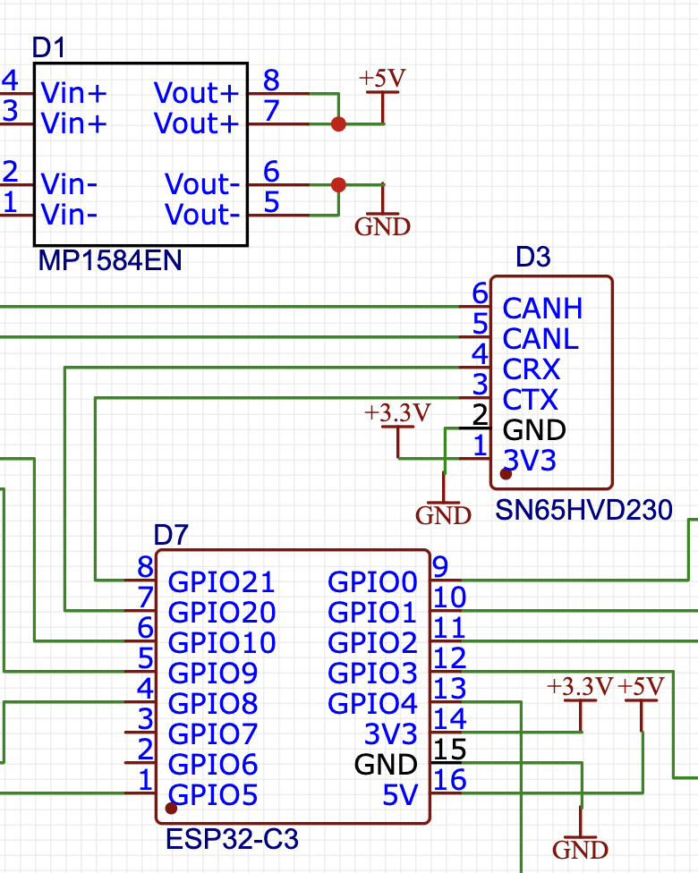
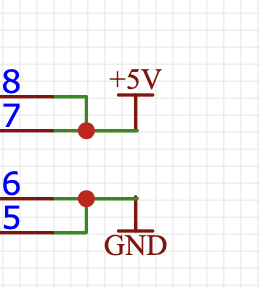
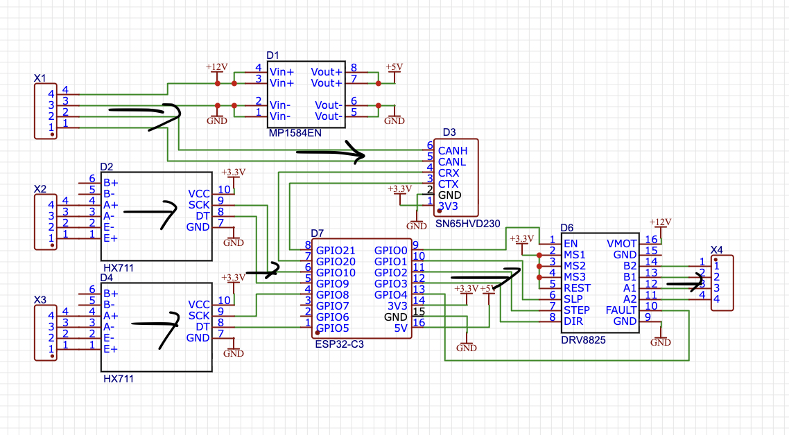

# Electrical Schematics

This document describes the common rules for schematic design followed by all subteams on the project. The goal is to make schematics from different subsystems look consistent, be easy to read for anyone on the team, and integrate smoothly(if necessary).

## 1. Software

All schematics are designed in [EasyEDA Std(Not Pro version)](https://easyeda.com/). This is required for file compatibility between subteams — a different editor version or tool may fail to open or convert the project correctly.

## 2. Color Scheme

We do not change the default colors:

- traces — **green**;
- component outlines — **black**;
- pins — **blue**.

This is the EasyEDA default, and keeping it consistent across all schematics makes the documentation easier to read for anyone on the team.

## 3. Trace Routing

- minimize the number of bends and crossings;
- traces must not pass through components.

## 4. Component Designators

Every component on the schematic is given a designator in the format **"LetterNumber"**. The letter depends on the component category:

| Letter | Category |
|--------|----------|
| C | Capacitor |
| D | Chip (integrated circuit) |
| F | Fuse, spark gap |
| G | Battery, accumulator |
| H | Indicator device (lamp, LED) |
| K | Relay or contactor |
| L | Inductor, choke |
| M | Electric motor |
| R | Resistor |
| S | Control switching device (button, switch) |
| T | Transformer |
| VT | Transistor |
| VD | Diode |
| X | Connector, terminal block |

The number is the sequential number of the component within that category on the schematic, starting from one (e.g., R1, R2, C1).

If a category is missing from the list — let us know, and we'll agree on a designator together.

**The actual component name** is also shown on the schematic, as a caption below the image next to its letter-number designator. This is needed because original component names are often long and unwieldy, while short designators in the "LetterNumber" format make later PCB layout and assembly much easier.

Example:

## 5. Power Designations

We use **"GND"** for ground and **"Rating.V"** for voltage, for example: **"3.3V"**, **"5V"**, **"12V"**.

Example:

## 6. Component Placement

Where possible, we follow a left-to-right signal flow: components responsible for **input** (e.g., sensors) are placed on the **left**, and those responsible for **output**/control (e.g., motor drivers) are placed on the **right**. This isn't always achievable perfectly, but even partial adherence significantly improves schematic readability.

Example:

