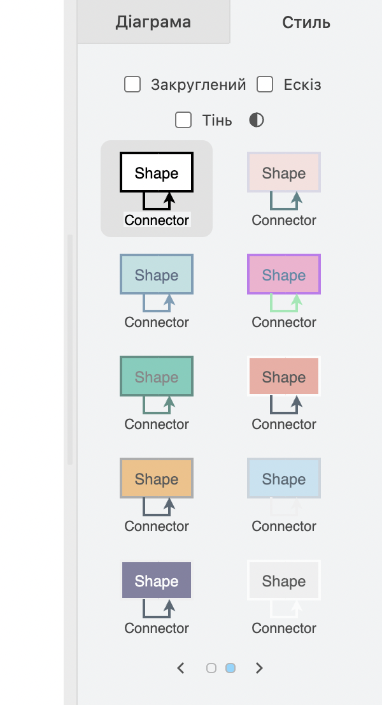
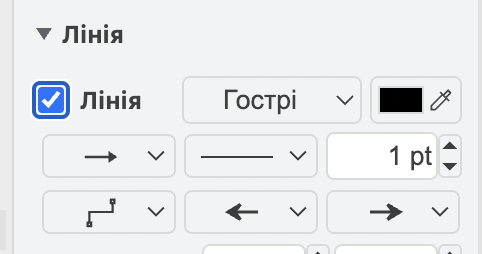
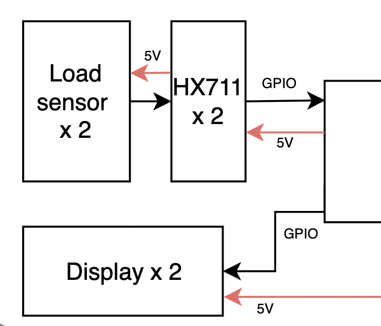

# Schematics

This document contains two separate standards: one for draw.io diagrams and one for electrical schematics. The goal is to keep each type of artifact consistent, easy to read, and easy to integrate into the final report when needed.

## 1. Draw.io Diagrams

### 1.1 Theme

- Use the standard **black-and-white theme**.
- White background.
- Black outline for shapes.
- White fill for shapes.
- Default outline thickness is **1 pt**.

### 1.2 Font

- Use **Helvetica** for all diagrams.
- Use the same font size for elements of the same type.
- Do not mix different fonts within one diagram.

### 1.3 Arrows and Connections

- Preferably use black arrows with a thickness of **1 pt**. The settings shown in the image below.

- By default, all connections should be black.
- If color improves readability or helps distinguish signal or flow types, colored arrows are allowed.
- Use **no more than 5-6 colors** in a single diagram.

### 1.4 Labels

- Place arrow labels **above or below the arrow**, without placing text on the line.
- Text must not overlap other diagram elements.
- Use one consistent label style for the same type of elements.

For example:

### 1.5 Element Placement

- Avoid crossing arrows whenever possible.
- Use alignment and even spacing between elements.
- The diagram should be easy to read, preferably left-to-right or top-to-bottom.

### 1.6 Colors

- The default diagram style is **monochrome**.
- Use color only when it adds information.
- Do not use color purely for decoration.

### 1.7 Imported Diagrams

- After importing a diagram, turn off the grid (**Grid**).

## 2. Electrical Schematics

### 2.1 Software

All electrical schematics are designed in [EasyEDA Std(Not Pro version)](https://easyeda.com/). This is required for file compatibility between subteams — a different editor version or tool may fail to open or convert the project correctly.

### 2.2 Color Scheme

We do not change the default colors:

- traces — **green**;
- component outlines — **black**;
- pins — **blue**.

This is the EasyEDA default, and keeping it consistent across all schematics makes the documentation easier to read for anyone on the team.

### 2.3 Trace Routing

- minimize the number of bends and crossings;
- traces must not pass through components.

### 2.4 Component Designators

Every component on the schematic is given a designator in the format **"LetterNumber"**. The letter depends on the component category:

| Letter | Category |
|--------|----------|
| C | Capacitor |
| D | Chip (integrated circuit) |
| F | Fuse, spark gap |
| G | Battery, accumulator |
| H | Indicator device (lamp, LED) |
| K | Relay or contactor |
| L | Inductor, choke |
| M | Electric motor |
| R | Resistor |
| S | Control switching device (button, switch) |
| T | Transformer |
| VT | Transistor |
| VD | Diode |
| X | Connector, terminal block |

The number is the sequential number of the component within that category on the schematic, starting from one (e.g., R1, R2, C1).

If a category is missing from the list — let us know, and we'll agree on a designator together.

The actual component name is also shown on the schematic, as a caption below the image next to its letter-number designator. This is needed because original component names are often long and unwieldy, while short designators in the "LetterNumber" format make later PCB layout and assembly much easier.

Example:

### 2.5 Power Designations

We use **"GND"** for ground and **"Rating.V"** for voltage, for example: **"3.3V"**, **"5V"**, **"12V"**.

Example:

### 2.6 Component Placement

Where possible, we follow a left-to-right signal flow: components responsible for **input** (e.g., sensors) are placed on the **left**, and those responsible for **output**/control (e.g., motor drivers) are placed on the **right**. This isn't always achievable perfectly, but even partial adherence significantly improves schematic readability.

Example:

